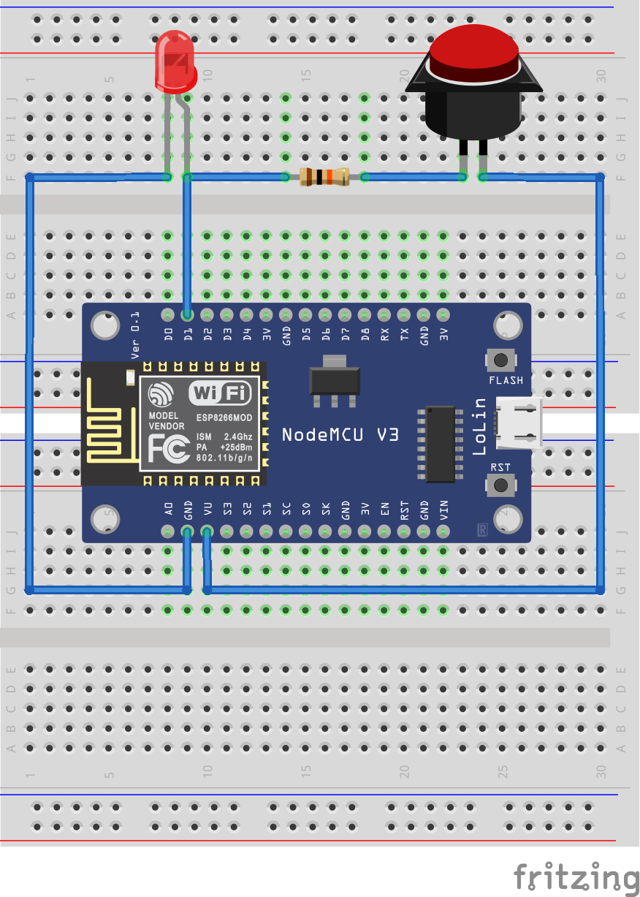
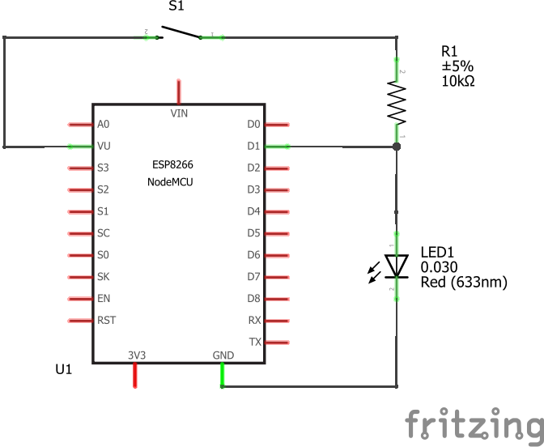
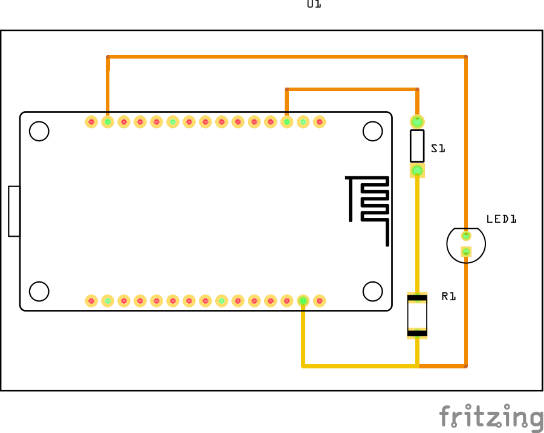

# Código y esquema del circuito para el Botón de Pánico

Aquí se encuentra una carpeta con el código a subir al NodeMcu ESP-12E (ESP-8266); además de un archivo creado con el programa Fritzing, este detalla el diagrama de las conexiones para el dispositivo físico.

## Código NodeMcu ESP-12E

Teniendo la placa de desarrollo NodeMcu, la cuál lleva integrada el módulo ESP-12E (es decir, el ESP-8266), podemos conectar el pulsador a internet mediante tecnología WiFi.

En el archivo `panic/panic.ino` se debe actualizar los valores del nombre de la red WiFi (SSID) y la contraseña de esta (password).

```c++
const char *ssid = "YOUR_SSID"; //Nombre de la red
const char *password = "YOUR_PASSWORD"; //Contraseña
```

## Consideraciones sobre compatibilidad con otros módulos

El proyecto se realizó con el módulo ESP-8266, pero de ser necesario utilizar un reemplazo, podría lograrse con el módulo ESP-32 fácilmente, solo cambiando dos líneas de código referentes a las librerias importadas.

Cambiar las siguientes líneas de código:

```c++
//si usas esp8266
#include <ESP8266WiFiMulti.h>
#include <ESP8266HTTPClient.h>
```

Por estas otras líneas:

```c++
//si usas esp32
#include <HTTPClient.h>
#include <WiFi.h>
```

**Importante asegurarse que las conexiones correspondan al módulo utilizado.**

## Consideraciones

Se incluyó un led en el circuito, pero este solo es para verificar que el pulsador esté funcionando correctamente sin tener que ver el monitor serial. Por lo que, se puede omitir su inclusión sin afectar el funcionamiento del botón de pánico.

### Diagrama de conexión protoboard

Se utilizó el siguiente diagrama para la conexión en protoboard.


### Diagrama de conexión esquemático

Se tiene el siguiente diagrama esquemático.


### Diagrama de conexión para PCB

Se tiene el siguiente diagrama en caso de requerir instalarlo en una PCB.


#### Funcionamiento

- Se importa las librerías necesarias según el módulo utilizado (ESP-8266 o ESP-32).
- Se definen las credenciales de la red WiFi y los datos a enviar al servidor.
- Se define el estado del pulsador como no presionado.
- Se define el pin D1 (GPI05) como entrada para saber si el pulsador está presionado o no. Sería el pin digital 5 para Arduino.
- **El dispositivo NodeMcu se conecta a la red WiFi con las credenciales definidas anteriormente.**
- Se define la función `void enviarData()`, lo que hace es enviar los datos al servidor mediante el método POST si es que el WiFi está conectado correctamente, de lo contrario en el monitor serial nos avisa del error en la conexión WiFi.
- **Luego, en el `loop()` lee el estado del pin digital 5 (pin D1) para verificar si se cerró el circuito al presionar el pulsador.**
- **En caso de estar presionado el pulsador ejecuta la función `enviarData()` para enviar los datos al servidor y generar la alerta.** De lo contrario, solo avisa por el monitor serial que no se está presionando el pulsador.
