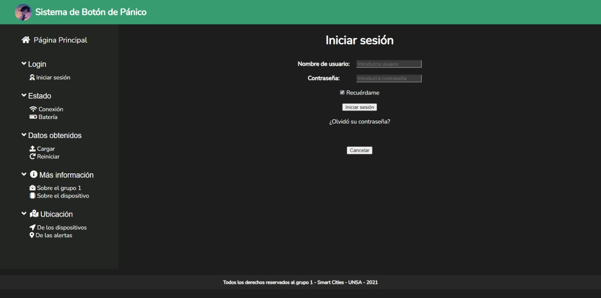

# Sistema de Botón de Pánico
El Botón de pánico de emergencia SOS con Wi-Fi brinda un medio para crear señales de auxilio en casos de emergencias.

# Capturas de Pantalla




# Instalación para desarrollo
- Clona el repositorio en una carpeta local.
- Abre la consola o terminal en la raiz del proyecto (en Visual Studio Code se abre con `Ctrl+Ñ`).
- Ejecuta `npm install` para instalar los módulos requeridos como `Express`, `Morgan` y `EJS`.
- Con el comando `npm run dev` activamos el módulo de desarrollo `nodemon`, que nos permite actualizar cambios en el web server sin tener que reiniciarlo manualmente.

```shell
git clone https://github.com/xenom-flauta-dulce/panic-button-system.git
npm install
npm run dev
```
luego visita en el navegador: `localhost:5500`

# Personalización
- `puerto`, este es el puerto http del server. por defecto es `5500`.
Para cambiarlo, ir a `src\index.js` y configurar el número de puerto en la línea:
```
app.set('puerto', process.env.PORT || 5500);
```

## Tareas Pendientes

- [ ] Agregar código arduino que envía datos para la alarma al presionar botón.
- [ ] Permitir inicio de sesión mediante JSON o Google.
- [ ] Visualizar los eventos en forma de tabla y/u otro tipo de gráficos estadísticos.
- [ ] Conectar los datos de Arduino mediante POST con la API de Google Maps.
- [x] Tema oscuro
- [ ] Tema claro
